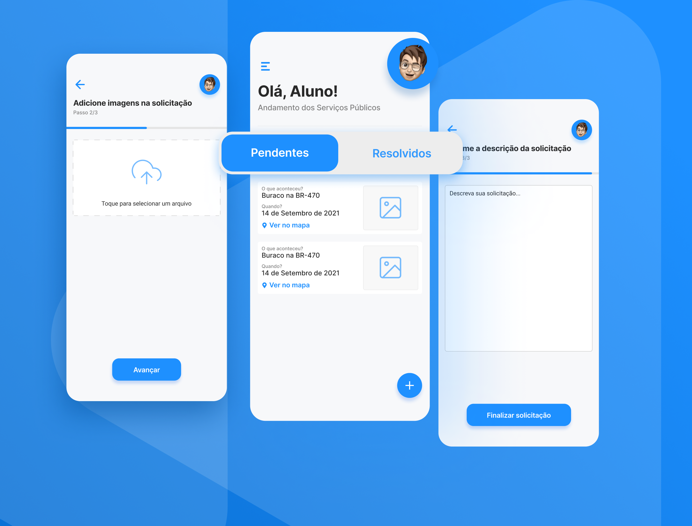

 

## 💻 Projeto

O Conserta Aqui é um aplicativo que permite que os cidadãos façam solicitações de consertos em espaços públicos.

Através dele será possível abrir demandas diretamente para o setor de obras da prefeitura, por exemplo buracos em ruas, lâmpadas queimadas, bueiros entupidos, etc.
